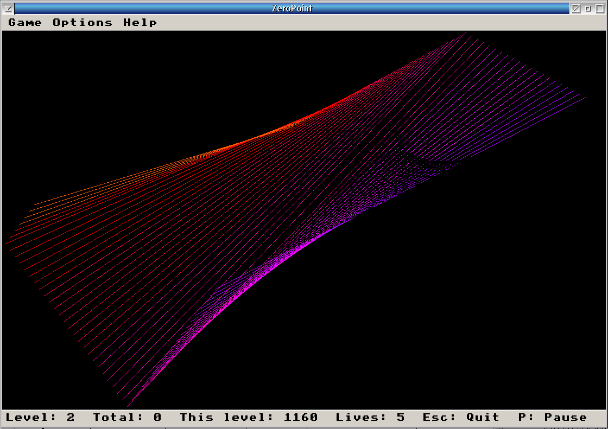

# ZeroPoint

A video game for ArcaOS / OS/2.



Original game by Enumerate Inc., Copyright © 1996–1998.  
ArcaOS SDL2 port — version **0.9.5**.

---

## Goal

A polygon bounces around the screen.  
Your job is to **slow it to a complete stop** — the "Zero Point" — before the level bonus runs out.

Use the arrow keys to push against the polygon's current motion.
Watch the bonus bar in the status strip: it drains from green to red over time.
Stop the polygon while there is still bonus remaining and you advance to the next level,
collecting that bonus as score. Miss it and you lose a life.

Each level adds a side to the polygon and speeds it up.

---

## Controls

| Key | Action |
|-----|--------|
| Arrow keys | Adjust the polygon's velocity |
| Numpad (1/3/7/9) | Adjust velocity diagonally |
| **P** or Pause | Pause / Resume |
| **N** or Ctrl+N | New game (confirm) |
| **R** | Restart current level (confirm) |
| **H** | Show high scores |
| **F1** | Show instructions |
| **F2** | About |
| **Esc** or Ctrl+X | Quit (confirm) |

You can also use the **File**, **Game**, **Options**, and **Help** menus.

---

## Status Bar

```
Level: 1  Total: 0  This level: 970  Lives: 5  Esc: Quit, P: Pause
```

- **Level** — current level number
- **Total** — accumulated score across levels
- **This level** — bonus remaining for the current level (drains over time)
- **Lives** — lives remaining

---

## Scoring

- Completing a level adds the remaining **This level** bonus to your **Total** score.
- Losing all lives ends the game and prompts for a high score entry.

---

## System Requirements

- ArcaOS 5.x (or OS/2 Warp 4 with appropriate libraries)
- SDL2 runtime (`SDL2.dll`)
- SDL2_ttf runtime (`SDL2_ttf.dll`) — optional; used only if a TTF font is found

---

## Building from Source

### Requirements

- GCC (EMX/KLIBC toolchain, available via ArcaOS package manager)
- GNU make
- SDL2 development headers and libraries
- SDL2_ttf development headers and libraries (optional)

### Build

Run from the project root on ArcaOS:

```
compile.cmd
```

Or directly:

```
make -f makefile.gcc
```

The resulting executable is `bin\ZeroPoint.exe`.

### Configuration

Game options and high scores are stored in `zeropt.rc` (INI format) in the working directory.
Delete this file to reset everything to defaults.

Default window size: **1200 × 800**.  
This can be changed by editing `MaxX` and `MaxY` in `zeropt.rc`.

---

## Files

```
README.md              This file
compile.cmd            ArcaOS build script (outputs to compile.cmd.log)
makefile.gcc           GNU make build rules
zeropt.png             Application icon (PNG source)
src/
  main.cpp             SDL2 main: window, rendering, game loop, menus
  poly.cpp / poly.h    Polygon class
  pwalk.cpp / pwalk.h  Polygon-walk (ring buffer of bouncing polygons)
  wlnopt.cpp / wlnopt.h   Game options/defaults
  wlndefs.h            Shared constants and structs
  genArray.h           Templated dynamic array
  zeropt.def           OS/2 module definition file
  resource.rc          OS/2 icon resource script
  ZeroPoint.ico        Application icon (multi-size ICO)
doc/
  changelog.txt        Version history
bin/
  ZeroPoint.exe        Compiled executable (after build)
```

---

## License

Original source code licensed under the **GNU General Public License version 2 or later**.  
See the `COPYING` file or <https://www.gnu.org/licenses/> for details.
